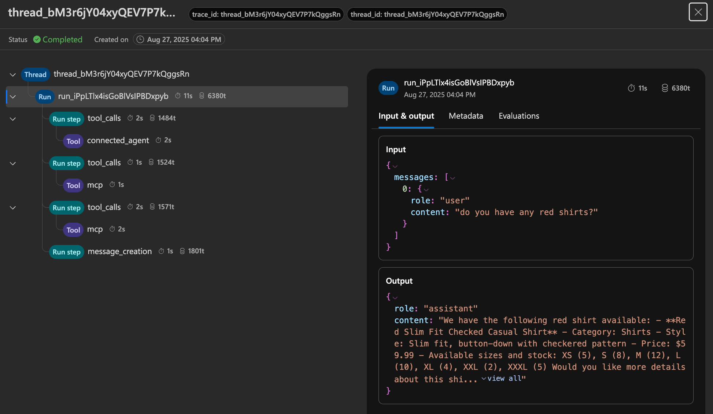

# Fashion Assistant with .NET Aspire and Azure AI Foundry Multi-Agent Architecture

This sample demonstrates a modern cloud-native fashion e-commerce application built with [.NET Aspire](https://learn.microsoft.com/dotnet/aspire/get-started/aspire-overview) and Azure AI Foundry's multi-agent architecture. The application showcases how to create intelligent shopping experiences using connected agents, the MCP (Model Context Protocol) tool, and the OpenAPI specified tool.

## .NET Aspire on Azure App Service

This project leverages .NET Aspire for enhanced development experience and Azure App Service for production deployment. As outlined in the [.NET Aspire on App Service blog post](https://azure.github.io/AppService/2025/05/19/Aspire-on-App-Service.html), .NET Aspire on App Service is currently in **preview** with some limitations. This sample works within those constraints to provide a sample app with a multi-agent architecture.

## Prerequisites

Before you begin, ensure you have:
- [.NET 9 SDK](https://dotnet.microsoft.com/download/dotnet/9.0)
- [Azure Developer CLI (azd)](https://aka.ms/azd)
- [Python 3.8+](https://www.python.org/downloads/) for the agent setup script
- Azure subscription with access to Azure AI Foundry
- [Visual Studio 2022](https://visualstudio.microsoft.com/) or [Visual Studio Code](https://code.visualstudio.com/)

## Step 1: Deploy the Inventory Service

First, deploy the external inventory service that provides product data via MCP (Model Context Protocol). The clothing store inventory is hosted in a separate App Service. The main app will connect to the inventory to populate the counts of the clothing items in the main app. And the Foundry agent will connect to the inventory using MCP so that it can look up inventory and product availablity while you chat with it. You should put the inventory in it's own resource group, which will be set-up when you run `azd up`.

```bash
git clone https://github.com/seligj95/app-service-python-mcp-inventory.git
cd app-service-python-mcp-inventory
azd up
```

Follow the prompts to complete the deployment. This will take about 5 minutes to complete.

**📝 Important:** Note the App Service URL from the deployment (e.g., `https://app-web-xyz123.azurewebsites.net`). You'll need this URL in the following steps.

This inventory service provides:
- REST API endpoints for product data
- MCP server endpoint for dynamic agent access
- Sample fashion inventory with sizes, prices, and stock levels

## Step 2: Deploy the Main Application

**⚠️ Important Regional Requirement:**
This application uses the [MCP Tool](https://learn.microsoft.com/en-us/azure/ai-foundry/agents/how-to/tools/model-context-protocol#how-it-works) which is currently in preview and only available in specific Azure regions. You **must** deploy your Azure AI Foundry resources in one of these supported regions:

- `westus` (West US)
- `westus2` (West US 2) 
- `uaenorth` (UAE North)
- `southindia` (South India)
- `switzerlandnorth` (Switzerland North)

This region list has been updated as of August 26, 2025. To see the latest list of supported regions, see the [Connect to Model Context Protocol servers (preview) documentation](https://learn.microsoft.com/en-us/azure/ai-foundry/agents/how-to/tools/model-context-protocol#how-it-works).

When prompted during `azd up`, make sure to select one of these regions for your deployment.

Clone and deploy this fashion assistant application:

```bash
git clone https://github.com/seligj95/app-service-aspire-eshop-agents.git
cd app-service-aspire-eshop-agents
azd up
```

Follow the prompts to complete the deployment. This will take about 5 minutes to complete.

This will provision:
- Azure App Service for the web application
- Azure AI Foundry project and resources
- All necessary infrastructure via Bicep templates

## Step 3: Local Development (Optional)

You can run the application locally to see the interface and test basic functionality:

### Setup Environment Variables

Create a `.env` file in the root directory:

```env
EXTERNAL_INVENTORY_URL=https://your-inventory-app.azurewebsites.net
```

Replace with your actual inventory service URL from Step 1.

### Run Locally

```bash
cd src/ai-agent-openai-web-app.AppHost
dotnet run
```

This will:
- Launch the **Aspire Dashboard** (typically at `https://localhost:17071`)
- Start the web application with enhanced observability
- Provide real-time monitoring and logging
- Enable hot reload for development

**⚠️ Important Notes for Local Development:**
- The **chat functionality will NOT work locally** because your local machine doesn't have access to Azure AI Foundry like the deployed App Service has using managed identity
- Local development is primarily for:
  - Seeing the application UI and structure
  - Testing basic navigation and components
  - Viewing the Aspire dashboard and telemetry since the Aspire dashboard is not supported on App Service yet
  - Making development changes with hot reload

**The chat and AI agents will only work after deploying to Azure and completing the setup steps below.**

## Step 4: Configure Inventory URL in App Service

After deployment, configure the inventory service URL in your fashion store App Service (note that you are adding the app settings to the fashion store, not the inventory app):

1. Go to **Azure Portal** → Your fashion store App Service
2. Navigate to **Settings** → **Environment variables**
3. Add the app setting:
   - **Name:** `EXTERNAL_INVENTORY_URL`
   - **Value:** `https://your-inventory-app.azurewebsites.net` (from Step 1)
4. Click **Save** and **Confirm** when prompted
5. This will restart the App Service and the changes will take effect in a couple minutes. 

You can now access the app to see the working shopping experience. The chat experience will not work at this point since you haven't created and added the agents yet.

## Step 5: Create AI Agents with Python Script

Now create the multi-agent architecture using the included Python setup script:

### Why Use This Script?

We use a Python script to create **persistent agents** for demo purposes, allowing you to:
- See all agents in the Azure AI Foundry portal
- Understand the multi-agent architecture visually
- Modify agent instructions and tools easily
- Debug agent interactions in Foundry

We are using a Python script because the Python SDK is the most mature and the Azure Foundry portal does not support creating agents with the MCP tool yet. Once the portal supports MCP tool creation, we will provide guidance for portal setup as well.

**Note:** In production, you might prefer **dynamic agents** that are created on-demand, but persistent agents are good for demos and development.

### Agent Architecture

This script creates a multi-agent system with the following architecture:

```
┌─────────────────────────────────────────────────────────────┐                       ┌──────────────────┐
│                Fashion Store Orchestrator                   │───────────────────────│  Inventory API   │
│                     (Main Coordinator)                      │  MCP Tool Connection  │   (External)     │
│              • Connected to specialist agents               │                       │                  │
│              • Has MCP Tool for inventory access            │                       │ • Product data   │
└──────────────────────┬──────────────────────────────────────┘                       │ • Stock levels   │
                       │                                                              │ • Pricing info   │
        ┌──────────────┼─────────────────┐                                            └──────────────────┘
        │              │                 │                         
        ▼              ▼                 ▼                                
┌─────────────┐ ┌──────────────┐ ┌─────────────────┐         
│   Cart      │ │   Fashion    │ │   Content       │         
│  Manager    │ │   Advisor    │ │  Moderator      │         
│             │ │              │ │                 │         
│ • Add items │ │ • Style tips │ │ • Safety checks │         
│ • Remove    │ │ • Outfit     │ │ • Topic         │         
│   items     │ │   advice     │ │   validation    │         
│ • View cart │ │ • Trends     │ │                 │         
└─────────────┘ └──────────────┘ └─────────────────┘         
        │                                                    
        │ OpenAPI Tool                                       
        ▼                                                    
┌─────────────────┐                                          
│   App Service   │                                          
│   Cart API      │                                          
│                 │                                          
│ • Shopping cart │                                          
│   operations    │                                          
│ • Product data  │                                          
└─────────────────┘                                          
```

### Agent Types and Tools

**1. Main Orchestrator Agent:**
- **Purpose:** Coordinates all other agents and handles user interactions
- **Tools:** 
  - Connected Agent Tools (connects to all specialist agents)
  - [MCP Tool](https://learn.microsoft.com/en-us/azure/ai-foundry/agents/how-to/tools/model-context-protocol#setup) for direct inventory access
- **Actions:** Inventory queries, workflow coordination, agent delegation

**2. Cart Manager Agent:**
- **Purpose:** Handles shopping cart operations
- **Tools:** [OpenAPI Tool](https://learn.microsoft.com/en-us/azure/ai-foundry/agents/how-to/tools/openapi-spec) connecting to App Service cart endpoints
- **Actions:** Add/remove items, view cart, update quantities

**3. Fashion Advisor Agent:**
- **Purpose:** Provides styling advice and fashion recommendations
- **Tools:** None (uses AI knowledge only)
- **Actions:** Style tips, outfit coordination, fashion trends

**4. Content Moderator Agent:**
- **Purpose:** Ensures conversations stay appropriate and on-topic
- **Tools:** None (uses AI reasoning)
- **Actions:** Content filtering, topic validation

### Connected Agents Architecture

This sample uses [Connected Agents](https://learn.microsoft.com/en-us/azure/ai-foundry/agents/how-to/connected-agents?pivots=csharp) to create a seamless multi-agent experience where the main orchestrator automatically delegates tasks to specialist agents.

**MCP Tool Implementation:**
The MCP tool is attached directly to the **main orchestrator agent** because:
- MCP tool requires [runtime parameters](https://learn.microsoft.com/en-us/azure/ai-foundry/agents/how-to/tools/model-context-protocol#setup) that can only be passed when initiating a run (sending a message to the agent). Because we're using persistent agents, the app is only connected to the main agent and not the connected agents. Therefore, we can't pass the runtime parameters to a connected agent. If we were instead using dynamic agents, which get created with each run, we could definitely pass those parameters to a connected agent. This would allow us to have a dedicated inventory manager agent. To simplify this demo, the MCP tool is given to the main agent.
- This architecture allows the main agent to search inventory and provide exact product IDs to the Cart Manager
- Connected agents work together seamlessly with the main agent's MCP capabilities

### Run the Setup Script

**Set Required Environment Variables:**

The script requires several environment variables. You can get these values from your Azure deployments:

```bash
# Ensure you're logged into Azure CLI
az login

# Set your inventory URL (from Step 1 - inventory service deployment)
export EXTERNAL_INVENTORY_URL='https://your-inventory-app.azurewebsites.net'

# Set your web app URL (from Step 2 - main app deployment) - this is the URL for the fashion app, not the inventory
export WEBAPP_URL='https://your-fashion-app.azurewebsites.net'

# Set your Azure AI Foundry project details (from Step 2 deployment)
# You can find these in Azure Portal → Resource group → AI Foundry project (make sure you select the project resource and NOT the parent Foundry resource → Resiyrce Management → Endpoints
export PROJECT_ENDPOINT='https://your-foundry-name.services.ai.azure.com/api/projects/your-foundry-project'
export MODEL_DEPLOYMENT_NAME='gpt-4.1'
```

**📝 How to find these values:**
- **EXTERNAL_INVENTORY_URL**: From Step 1 `azd up` output or Azure Portal → Inventory App Service → Overview → Default domain
- **WEBAPP_URL**: From Step 2 `azd up` output or Azure Portal → Fashion App Service → Overview → Default domain  
- **PROJECT_ENDPOINT**: Azure Portal → AI Foundry project → Settings → General → "Project details" section
- **MODEL_DEPLOYMENT_NAME**: Azure Portal → AI Foundry project → Deployments → Model deployments (use `gpt-4.1` as the value if you didn't change anything in the Bicep template used by azd)

**Create Python Environment and Run Script:**

```bash
# Create and activate a Python virtual environment
python -m venv venv
source venv/bin/activate  # On Windows: venv\Scripts\activate

# Install Python dependencies
pip install -r requirements.txt

# Run the agent setup script
python setup_agents.py
```

The script will:
1. Delete any existing agents (for clean setup)
2. Create all 4 agents
3. Set up connected agent relationships
4. Configure MCP and OpenAPI tools
5. Output the Main Orchestrator Agent ID

**📝 Save the Main Orchestrator Agent ID** - you'll need it for the next step.

You can go into Azure Foundry in the Azure portal to view the agents you just created and confirm setup is as expected.

## Step 6: Configure Main Agent in App Service

Add the agent ID to your App Service configuration:

1. Go to **Azure Portal** → Your fashion store App Service
2. Navigate to **Settings** → **Environment variables**
3. Add the app setting:
   - **Name:** `MAIN_ORCHESTRATOR_AGENT_ID`
   - **Value:** `agent_abcd1234` (the ID from the Python script output)
4. Click **Save** and **Continue** when prompted
5. This will restart the App Service and the changes will take effect in a couple minutes. 

## 🎉 Ready to Use!

Wait a couple minutes and then your multi-agent fashion assistant is now fully configured! Visit your App Service URL and try these interactions:

### Sample Conversations

**Inventory Queries:**
- "What denim jackets do you have in stock?"
- "Do you have any blazers in size medium?"
- "Show me all the shirts available"

**Shopping Cart:**
- "Add a small navy blazer to my cart"
- "What's in my cart?"
- "Remove the large shirt from my cart"

**Fashion Advice:**
- "What would go well with a black denim jacket?"
- "I need a business casual outfit suggestion"
- "What's trending in fashion right now?"

**Complex Multi-Agent Interactions:**
- "Find me a medium red shirt and add it to my cart" (uses both inventory and cart agents)
- "I'm looking for a complete outfit for a date night" (fashion advice + inventory checks)

## Tracing and Debugging Agent Interactions

One of the key advantages of this multi-agent architecture is the ability to trace and debug complex agent interactions. Azure AI Foundry provides comprehensive tracing capabilities that let you see exactly how your agents communicate and make decisions.

### Automatic Trace Information

**🔍 Built-in Trace IDs:**
Once you send a message, the application displays the **Thread ID** at the top of the chat for persistent visibility and automatically appends the **Run ID** to each agent response. If you hit the button to start a new conversation, the thread ID will disappear and a new one will be generated once you send your first message in that conversation. This makes it incredibly easy to find the exact conversation in the Azure portal.

**Note:** The run ID will not persist if you move between tabs in the fashion store, but the thread ID will remain visible.

### Viewing Traces in Azure AI Foundry Portal

**Step 1: Access Agent Threads**
1. Go to **Azure AI Foundry Portal** → Your project
2. Navigate to **Agents** in the left panel
3. Select the **"My threads"** tab
4. Find the thread associated with your main orchestrator agent (use the Thread ID from the top of the chat window)

**Note:** You'll see multiple threads because each agent-to-agent communication creates a new thread. Look for the thread with the main orchestrator agent ID, which uses the Thread ID provided in the application.

**Step 2: Open Thread Logs**
1. Select the relevant thread
2. Click **"Try in playground"**
3. Click **"Thread logs"** at the top of the screen
4. View the complete interaction trace. Each message has a run ID associated with it which you will also be able to see in the thread logs.

**Step 3: Analyze the Trace**
The trace view shows:
- **Thread:** Overall conversation context
- **Run:** Individual execution instances (use the Run ID from the response)
- **Run steps:** Granular steps within each run
- **Tool calls:** MCP and OpenAPI tool invocations
- **Inputs/Outputs:** Data flow between agents
- **Timing:** Duration of each step

### Example: Multi-Agent Trace for "Do you have any red shirts?"

Below is an example trace showing how the system handles an inventory query:



This trace shows:
1. **User message:** "do you have any red shirts?"
2. **Connected agent call:** Main orchestrator delegates to appropriate specialist
3. **MCP tool calls:** Multiple inventory API queries to find red shirts
4. **Step duration:** Time taken for each step in the process
5. **Response generation:** Formatted response with product details and availability

You can see the complete execution flow, timing, and data passed between each component.

### Advanced Tracing with Azure Monitor

For production applications, you can set up enhanced tracing with Azure Monitor Application Insights:

**Setup Requirements:**
1. Connect an Application Insights resource to your Azure AI Foundry project
2. Navigate to **Tracing** in the Azure AI Foundry portal
3. Configure the Application Insights connection

**Benefits of Azure Monitor Integration:**
- **Performance metrics:** Response times for each agent interaction
- **Error tracking:** Detailed error logs across the agent chain
- **Custom attributes:** Add business-specific context to traces
- **Query capabilities:** Use KQL to analyze trace patterns
- **Alerts:** Set up monitoring for performance degradation

For more detailed information about agent tracing, see the [Azure AI Foundry agent tracing documentation](https://learn.microsoft.com/en-us/azure/ai-foundry/how-to/develop/trace-agents-sdk).

## Architecture Benefits

This multi-agent architecture provides:

**🔄 Seamless Delegation:** The main agent automatically routes requests to the right specialist
**🛠️ Tool Integration:** OpenAPI and MCP tools provide real-time data access
**🔍 Transparency:** See all agent interactions in Azure AI Foundry
**📈 Scalability:** Easy to add new agents or modify existing ones
**🎯 Specialization:** Each agent excels at its specific domain

## Multi-Agent vs Single-Agent Architecture

### When to Choose Each Approach

This sample demonstrates a **multi-agent architecture**, but it's important to understand when this approach is beneficial versus a simpler **single-agent architecture** (like the [Azure AI Agent OpenAI Web App sample](https://github.com/Azure-Samples/ai-agent-openai-web-app)).

### Performance Considerations

**⚡ Single-Agent: Faster Response Times**
- Direct execution path with fewer handoffs
- Better for applications requiring semi-instantaneous responses
- Simpler debugging and monitoring

**🔄 Multi-Agent: More Handoffs, Higher Latency**
- Multiple agent interactions before returning to user
- Each handoff adds processing time and potential latency
- More complex execution flows

### Example: "Add a denim jacket to my cart"

Let's compare how each architecture handles this request:

#### Single-Agent Flow (3 steps)
```
User Request → Single Agent
                   ↓
            1. Content moderation check
                   ↓  
            2. Inventory lookup (MCP Tool)
                   ↓
            3. Add to cart (OpenAPI Tool)
                   ↓
            Response to User
```
**Estimated time:** ~2-3 seconds

#### Multi-Agent Flow (7 steps)
```
User Request → Main Orchestrator
                   ↓
            1. Route to Content Moderator
                   ↓
            Content Moderator → Main Orchestrator (approval)
                   ↓
            2. Main Orchestrator checks inventory (MCP Tool)
                   ↓  
            3. Route to Cart Manager
                   ↓
            4. Cart Manager adds item (OpenAPI Tool)
                   ↓
            Cart Manager → Main Orchestrator (confirmation)
                   ↓
            5. Main Orchestrator formats response
                   ↓
            Response to User
```
**Estimated time:** ~4-6 seconds

### Conceptual Approaches

**Single-Agent: "Monolithic" Architecture**
Single-Agent is conceptually a "monolithic" approach. This becomes unwieldy over time if you are adding substantively divergent tasks into a single agent. While simple to start with, the complexity grows as you add more diverse capabilities to a single agent.

**Multi-Agent: "Fine-Grained" Architecture**  
Multi-Agent is conceptually a "fine-grained" approach which allows you to make changes, editing and re-factoring individual sub-agents. This should make it more maintainable for complex agent flows where you have a need for different agents that specialize in handling different tasks.

### When to Use Multi-Agent

**✅ Choose Multi-Agent When:**
- **Specialization matters:** Different domains require different expertise
- **Team development:** Multiple teams working on different agent capabilities
- **Compliance needs:** Separate agents for content moderation, data validation
- **Complex workflows:** Multi-step processes with different business logic
- **Transparency required:** Need to see individual agent decisions
- **Future extensibility:** Plan to add more specialized capabilities

**Example use cases:**
- Financial services (compliance + analysis + recommendations)
- Healthcare (diagnosis + treatment + scheduling)
- E-commerce (inventory + recommendations + fraud detection)

### When to Use Single-Agent

**✅ Choose Single-Agent When:**
- **Speed is critical:** Real-time or near-real-time responses required
- **Simple workflows:** Straightforward request/response patterns
- **Small team:** Single team maintaining the entire system
- **Cost optimization:** Minimize complexity and latency overhead
- **Rapid prototyping:** Quick proof-of-concept development

### Sample Multi-Agent Interaction Flows

#### Complex Query: "I need a business casual outfit for an interview"

```
1. User → Main Orchestrator
2. Main Orchestrator → Content Moderator (validate request)
3. Content Moderator → Main Orchestrator (approved)
4. Main Orchestrator → Fashion Advisor (outfit suggestions)
5. Fashion Advisor → Main Orchestrator (business casual recommendations)
6. Main Orchestrator → Inventory API via MCP (check availability)
7. Main Orchestrator → Fashion Advisor (refine based on stock)
8. Fashion Advisor → Main Orchestrator (final outfit selection)
9. Main Orchestrator → User (present outfit suggestions and ask for confirmation)
10. User → Main Orchestrator (approval to proceed)
11. Main Orchestrator → Cart Manager (add multiple items)
12. Cart Manager → App Service API (cart operations)
13. Cart Manager → Main Orchestrator (confirmation)
14. Main Orchestrator → User (complete outfit added with styling tips)
```

**Total interactions:** 14 steps vs 4-5 for single agent

## Troubleshooting

**Chat Not Responding:**
- Verify the `MAIN_ORCHESTRATOR_AGENT_ID` app setting is correctly set
- Check that your Azure AI Foundry resources are properly provisioned
- Ensure the App Service managed identity has permissions to access AI Foundry

**Inventory Issues:**
- Confirm the `EXTERNAL_INVENTORY_URL` points to your deployed inventory service
- Test the inventory API directly: `https://your-inventory-app.azurewebsites.net/api/inventory`
- Check that the inventory service is running and accessible

**Agent Setup Issues:**
- Ensure you have the correct Azure credentials configured
- Verify the Python dependencies are installed
- Check that your Azure AI Foundry project is accessible

## Clean Up

When you're finished exploring the demo:

```bash
# Delete the main application
azd down

# Delete the inventory service
azd down
```

## Learn More

- [.NET Aspire Documentation](https://learn.microsoft.com/dotnet/aspire/)
- [Azure AI Foundry Connected Agents](https://learn.microsoft.com/en-us/azure/ai-foundry/agents/how-to/connected-agents?pivots=csharp)
- [MCP Tools Setup](https://learn.microsoft.com/en-us/azure/ai-foundry/agents/how-to/tools/model-context-protocol#setup)
- [OpenAPI Tools](https://learn.microsoft.com/en-us/azure/ai-foundry/agents/how-to/tools/openapi-spec)
- [.NET Aspire on App Service](https://azure.github.io/AppService/2025/05/19/Aspire-on-App-Service.html)

## License

This project is licensed under the MIT License - see the [LICENSE.md](LICENSE.md) file for details.